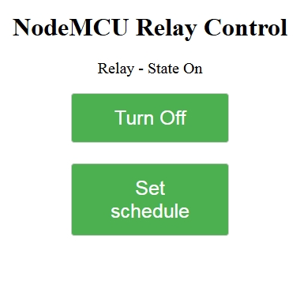
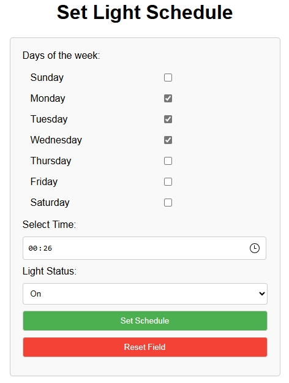
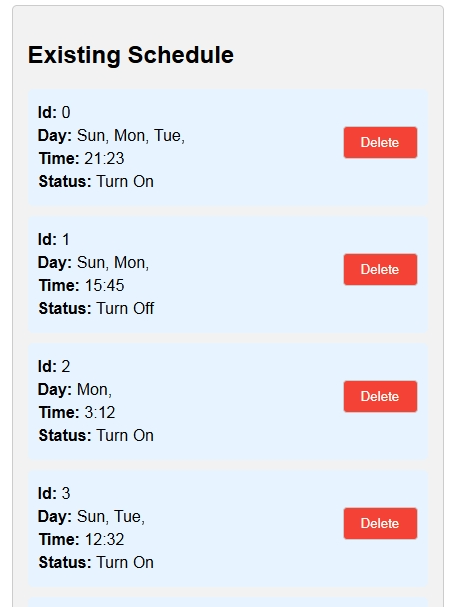

# NodeMCU WebServer Relay
Web server on NodeMCU ESP8266 dev board for controlling IO pins.

## Features
* Relay control (IO pin control) via webserver interface with the wifi module working in mode client.
* Support setting of up to schedules for on/off IO pin by day/hour/minute via webserver interface.
* Schedule can run without internet connection (RTC drift time to be tested).
* Automatically synchronize with NTP server for accurate RTC.
* Previous states and schedules are stored in eeprom.

## Setting up
* Allow to control an IO pin via webserver (I connected the D1 pin to control relay).
* Button with pull-up resistor on D2 pin.
* After starting up, the board must connect to internet at least once to synchronize RTC and enable schedule setting (modify the NTP server and timezone in the webserver.h)

## Commands
* log on : toggle log on.
* log off : toggle log off.
* wifi set [my_ssid+my_pwd] : set wifi ssid and password.
* relay on : switch on the relay pin.
* relay off : switch off the relay pin.
* relay status : get the actual relay status.
* schedule add : add schedule.
* schedule delete [id] : delete schedule.
* schedule get : display all registered schedule.
* device reset : reset device.

## Demo

